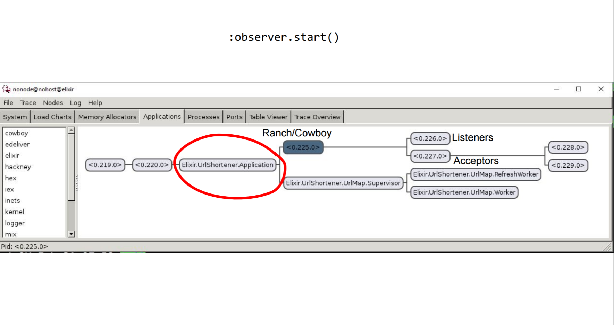

name: inverse
layout: true
class: inverse

---
class: center, middle

# Introduction to Elixir

---

### About me


---
# $ whoami

## Mattia - @ghedamat (github/twitter/slack)
## Developer @ [Precision Nutrition](https://precisionnutrition.com)
## Co-Organizer of ElixirTo ([@torontoelixir](https://twitter.com/torontoelixir))

## Lots of Ruby & JS by day
## Elixir whenever I can

---
# What is Elixir


---

# A new(ish) programming language

## Based on the Erlang VM (BEAM)


---

# Jose Valim

## Rails core member

## Author of numerous important gems (e.g. devise)

## Felt usabilty of Ruby was great but semantics had problems

## Second BEAM based language he wrote, first one was OO

## Elixir's syntax is very reminiscent of Ruby's

---
# **Features**

# Functional

# Immutable

# Concurrent

# Metaprogramming (macros)

# Tooling (iex, hex, mix)

# Interop

---
# **Designed to build apps that are:**

# Distributed

# Fault-tolerant

# Scalable (horizontal and vertical)

# Highly-resilient

---

# **Why should I care?**

# Vertical Scaling has a limit

## increasing number of cores
## fork model doesn't work that well
## need to start using all resources

# It's FAST and has great ergonomics

# Easy to learn/get started

# Big ecosystem

---

class: center, middle

# Let's dive in

## Warning: code ahead


---

# Basic Types

```elixir

iex> 42                        # integer

iex> 4.2                       # float

iex> true                      # boolean

iex> :ghedamat                 # atom

iex> "Toronto Elixir"          # string

iex> [1, 2, 3]                 # (linked) list

iex> {1, 2, 3}                 # tuple

iex> %{a: "foo", b: "bar"}     # map

iex> %{"a" => "foo", "b" => "bar"}

```

---

# Basic Operators

```elixir

iex> 10 + 5                    # 15

iex> "string" <> "concat"      # "stringconcat"

iex> "string #{5 - 1}"         # "string 4"

iex> true and false            # false

iex> [1, 2, 3] ++ [4, 5]       # [1, 2, 3, 4, 5]

iex> [1, 2, 3] -- [2]          # [1, 3]

iex> [1 | [2]]                 # [1, 2]

```

---

# Pattern Matching

```elixir

iex> x = 1
1

iex> x
1

iex> 1 = x
1

iex> 2 = x
** (MatchError) no match of right hand side value: 1

iex> 1 = unknown
** (CompileError) iex:1: undefined function unknown/0
```

---

# Pattern Matching (cont'd)

```elixir

iex> {a, b, c} = {:hello, "world", 42}
{:hello, "world", 42}

iex> a
:hello

iex> b
"world"

iex> {a, b, c} = {:hello, "world"}
** (MatchError) no match of right \
hand side value: {:hello, "world"}

iex> {a, b, c} = [:hello, "world", 42]
** (MatchError) no match of right \ 
hand side value: [:hello, "world", 42]

```

---

# Pattern Matching (common uses)

```elixir
iex> {:ok, result} = {:ok, 42}
{:ok, 42}
iex> result
42

iex> [head | tail] = [1, 2, 3]
iex> head
1
iex> tail
[2, 3]

iex> {a, _, c, _} = {:a, :b, :c, :d}

```

---

# Control Flow

```elixir
iex> case {1, 2, 3} do
...>   {4, 5, 6} ->
...>     "this won't match"
...>   {1, x, 3} ->
...>     "this will bind x to 2"
...>   _ ->
...>     "this matches all the time"
...> end

"this will bind x to 2"

iex> cond do
...>   2 + 2 == 5 ->
...>     "this won't be true"
...>   2 * 2 == 3 ->
...>     "this won't be true"
...>   1 + 1 = 2 ->
...>     "this will"
...>   true ->
...>     "always true"
...> end

"this will"
```

---

# Control Flow

```elixir

iex> if true do
...>   "this"
...> else
...>   "that"
...> end

"this"

iex> if true, do: 1 + 2
3

iex> if false, do: :this, else: :that
:that

```

---

# Modules 

## Functions are grouped in modules

```elixir
defmodule Area do
  def rectangle(l, w) do
    mult(l, w)
  end
  
  def square(l) do
    rectangle(l, l)
  end
  
  defp mult(a, b) do
    a * b
  end
end

iex> Area.rectangle(2, 3)
6
```

---

# Function Capturing

```elixir

defmodule Area do
  def square(l) do
    l * l
  end
end

iex> list = [1, 2, 3]

iex> Enum.map list, fn l -> Area.square(l) end

iex> Enum.map list, &Area.square/1

```

---

# Multiple Arities

```elixir

defmodule Area do
  def rectangle(l) do
    rectangle(l, l)
  end

  def rectangle(l, w) do
    l * w
  end
end

iex> Area.rectangle(2, 3)
6

iex> Area.rectangle(2)
4

```

---

# Multiple Patterns & Recursion

## as always matching happens in order of definition

```elixir

defmodule Math do
  def sum_list([head | tail], accumulator) do
    sum_list(tail, head + accumulator)
  end

  def sum_list([], accumulator) do
    accumulator
  end
end

iex>  Math.sum_list([1, 2, 3], 0)
6
```

---

# Pipe Operator

```elixir
odd? = &(rem(&1, 2) != 0)

list = 1..100_000
tripled_list = Enum.map(list, &(&1 * 3))
only_odds = Enum.filter(tripled_list, odd?)
total = Enum.sum(only_odds)

# or 
Enum.sum(Enum.filter(Enum.map(1..100_000, &(&1 * 3)), odd?))

# much nicer
1..100_000
  |> Enum.map(&(&1 * 3))
  |> Enum.filter(odd?)
  |> Enum.sum

```

---

class: center, middle

# What about this concurrency thing?

---

class: center, middle

# Warning

## Lots of hand waving ahead

---

# Processes!

## All elixir code runs inside processes

## Processes are isolated

## They can **only** communicate via **message passing**

## They can be **supervised**

## Elixir processes are not system processes

## You can have hundreds of thousands of them!

---
class: center, middle


---

# Basic Process(ing)

```elixir
iex> pid = spawn fn -> 5 + 4 end
#PID<0.40.0>
iex> Process.alive?(pid)
false

# sending/receive messages
iex> send self(), {:hello, "world"}
{:hello, "world"}

iex> receive do
...>   {:hello, msg} -> msg
...>   {:world, msg} -> "won't match"
...> end
"world"

```

---

# Links

## Spawn

```elixir
# Normal spawn
iex> pid = spawn fn -> raise "broken" end
#PID<0.58.0>

[error] Process #PID<0.58.00> raised an exception
** (RuntimeError) oops
    :erlang.apply/2

```

## Spawn link
```elixir
iex> spawn_link fn -> raise "oops" end
#PID<0.41.0>

** (EXIT from #PID<0.41.0>) an exception was raised:
    ** (RuntimeError) oops
        :erlang.apply/2

# iex will restart in this case 
# but in general your process will crash
```

---

# Tasks

## Simpler primitive with better error reporting

```elixir
iex> task = Task.async fn -> long_compute() end

iex> do_some_other_work()

iex> Task.await(task, 1000)
# blocks until complete or timeout
```

---

class: center, middle

# Wait, how do I hold state??

---

# Holding State

## Few options:

## **Processes**

## ETS (Erlang Term Storage)

## External storage (Disk, DBs, ...)

---

# Storing state in a process

## A process can loop indefinitely

## Each interation of the loop will send/receive messages

## Every loop defines the new state

```elixir

defmodule KV do
  def start_link do
    Task.start_link(fn -> loop(%{}) end)
  end

  defp loop(map) do
    receive do
      {:get, key, caller} ->
        send caller, Map.get(map, key)
        loop(map)
      {:put, key, value} ->
        loop(Map.put(map, key, value))
    end
  end
end

```

---

# Storing state in a process (cont'd)


```elixir
iex> {:ok, pid} = KV.start_link
{:ok, #PID<0.62.0>}

iex> send pid, {:get, :hello, self()}
{:get, :hello, #PID<0.41.0>}

iex> flush()
nil
:ok

```

---

# Agents

## Another simpler primitive

## A simpler wrapper around state


```elixir
iex> {:ok, agent} = Agent.start_link fn -> [] end
{:ok, #PID<0.57.0>}

iex> Agent.update(agent, fn list -> ["eggs" | list] end)
:ok

iex> Agent.get(agent, fn list -> list end)
["eggs"]

iex> Agent.stop(agent)
:ok

```

---

# GenServer

## It's a process like any other

## It's a `behaviour`

## Abstracts client/server interaction

## Primitives to get/set state

## Hides the "looping"

## Provides error handling

---

# GenServer (cont'd)

## Public API (client)

### Runs on the caller process

## Private API (server)

### Receives messages in separate process

---

# GenServer example

```elixir
defmodule KV.Registry do

  use GenServer

  ## Client API

  def start_link do
    GenServer.start_link(__MODULE__, :ok, [])
  end

  def lookup(server, name) do
    GenServer.call(server, {:lookup, name})
  end

  def create(server, name) do
    GenServer.cast(server, {:create, name})
  end
  
  ...
```

---

# GenServer example (cont'd)

```elixir
  ## Server Callbacks

  def init(:ok) do
    {:ok, %{}}
  end

  def handle_call({:lookup, name}, _from, names) do
    {:reply, Map.fetch(names, name), names}
  end

  def handle_cast({:create, name}, names) do
    if Map.has_key?(names, name) do
      {:noreply, names}
    else
      {:ok, bucket} = KV.Bucket.start_link
      {:noreply, Map.put(names, name, bucket)}
    end
  end
end
```

---

# Supervisiors

## Handling failure

## "Let it crash"

## Processes that monitor other processes

## Another `behaviour`

## Based on GenServer


---

# Supervisor example

```elixir
defmodule KV.Supervisor do
  use Supervisor

  def start_link do
    Supervisor.start_link(__MODULE__, :ok)
  end

  def init(:ok) do
    children = [
      worker(KV.Registry, [KV.Registry])
    ]

    supervise(children, strategy: :one_for_one)
  end
end
```

---

# Supervision Trees



---

class: center, middle

# A quick note about Webapps


---

class: center, middle

# Phoenix

## A productive web framework that does not compromise speed and maintainability.

---

# Data Flow

## connection
## |> endpoint
## |> router
## |> pipelines
## |> controller
## |> model
## |> view

---

# Controllers

```elixir

defmodule MyApp.PageController do
  use HelloPhoenix.web, :controller

  def index(conn, _params) do
    render conn, "index.html"
  end
end

```

---

# Models

```elixir
defmodule MyApp.User do
  use HelloPhoenix.Web, :model

  schema "users" do
    field :name, :string
    field :email, :string
    field :bio, :string
    field :number_of_pets, :integer

    timestamps()
  end

  def changeset(struct, params \\ %{}) do
    struct
    |> cast(params, [:name, :email, :bio, :number_of_pets])
    |> validate_required([:name, :email, :bio, :number_of_pets])
  end
end
```

---

# Channels

```elixir
defmodule HelloPhoenix.RoomChannel do
  use Phoenix.Channel

  def join("room:lobby", _message, socket) do
    {:ok, socket}
  end
  def join("room:" <> _private_room_id, _params, _socket) do
    {:error, %{reason: "unauthorized"}}
  end

  def handle_in("new_msg", %{"body" => body}, socket) do
    broadcast! socket, "new_msg", %{body: body}
    {:noreply, socket}
  end

  def handle_out("new_msg", payload, socket) do
    push socket, "new_msg", payload
    {:noreply, socket}
  end
end
```

---

class: center, middle

# There's a LOT more to discover

## Maybe in another talk :)

---

class: center, middle

# Thanks!!!

## @ghedamat

